# 📦 Proyecto Final — E‑commerce con Spring Boot & Kafka

- Bienvenido al repositorio del proyecto **Spring Boot & Kafka - E-commerce**.  

- Este proyecto implementa un sistema de e‑commerce basado en microservicios con **Spring Boot** y **Kafka** .  

- Este documento permite que pueda **clonar, levantar, probar y validar** todo el sistema.
---
## 📂 Datos
- Nombre: Monica Miranda Ari
- Curso: Spring Boot & Kafka
- Celular: 71790842
---
## 🧩 Microservicios del Proyecto

| Servicio | Descripción | 
|---------|-------------|
| 🛒 **ecommerce-product-service** | Gestión de productos del ecommerce | 
| 📦 **ecommerce-inventory-service** | Control de inventario y stock | 
| 📑 **ecommerce-order-service** | Gestión de órdenes y flujo de compra | 

---
## 🛢️ Modelo de datos del Proyecto
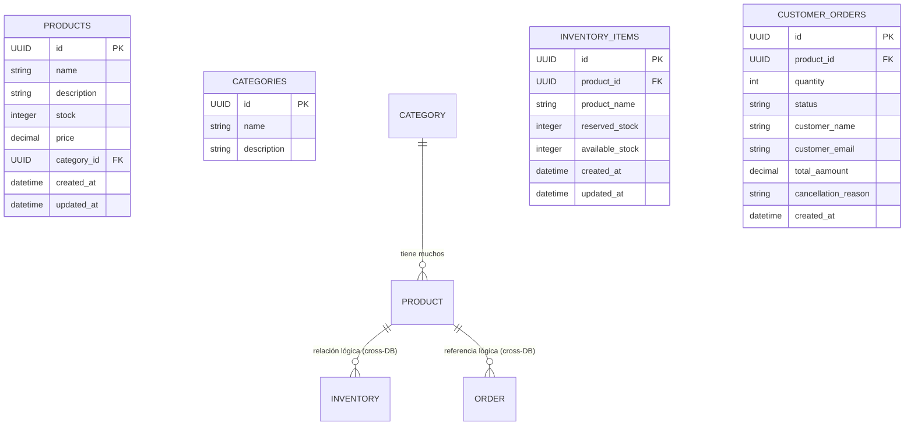
- 🗃 Explicación del Modelo
- 📌 Bases de datos involucradas
     - ecommerce → catálogo (productos y categorías)
     - ecommerce_inventory → stock disponible
     - ecommerce_orders → órdenes creadas por los clientes
---
---
## 🔄 Diagrama del Proyecto

```mermaid
flowchart LR
    A[product-service] -->|Kafka topics| D[(Kafka)]
    B[inventory-service] -->|Kafka topics| D
    C[order-service] -->|Kafka topics| D
    D --> B
    D --> C
 ```
---
## 🔁 Flujo Kafka Completo (end‑to‑end)

1. Product creado → produce → `ecommerce.products.created`
2. Order creada → produce → `ecommerce.orders.placed`
3. Inventory consume orden:
    - si hay stock → produce → `ecommerce.orders.confirmed`
    - si no hay → produce → `ecommerce.orders.cancelled`
4. Order Service actualiza estado final

---
## 🛠 Herramientas Previamente Requeridas

Inicialmente asegurarse de contar con las siguientes herramientas:

- Docker
- JDK 17+
- Maven 3.9+
- Postman
- Git
- Kafka
- IntelliJ IDEA (Ultimate)
---

## 🛠 Stack que se utilizó en el proyecto

- Dependecias:
```
  org.springframework.boot:spring-boot-starter-web:3.5.6
  org.postgresql:postgresql:42.7.7
  org.springframework.boot:spring-boot-starter-data-jpa:3.5.6
  org.springframework.boot:spring-boot-starter-validation:3.5.6
  org.springframework.kafka:spring-kafka:3.3.10
```

- Topics definidos para e-commerce
```
ecommerce.products.created
ecommerce.orders.placed
ecommerce.orders.confirmed
ecommerce.orders.cancelled
```

- Bases de datos **PostgreSQL (3 bases separadas)**
```
DATABASE ecommerce;
DATABASE ecommerce_orders;
DATABASE ecommerce_inventory;
```

- Docker (para levantar Postgres/Kafka)
- Maven
- Postman (colección incluida)
- GitHub
- Mermaid (diagramas en README)
- Docker Compose (Kafka)
- Variables de entorno (DB_HOST,DB_PASSWORD,DB_USER, DB_PORT)

---

## 🧩 El Proyecto tiene 3 Microservicios (product-service, order-service, inventory-service)
- Los 3 midroservicios estan con el dominio com.monicamiranda
- Cuentas con las capas minimas de: **controller, service, repository, model, dto, mapper, exception, kafka**
- Los 3 mictroservicios cuentan con archivos de configuración **(application.yml, ValidationMessages.properties).**
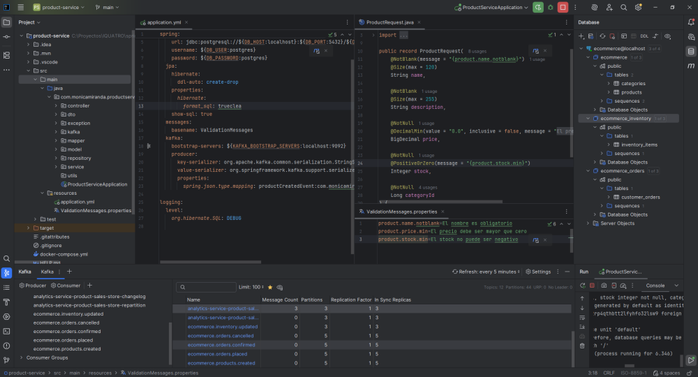
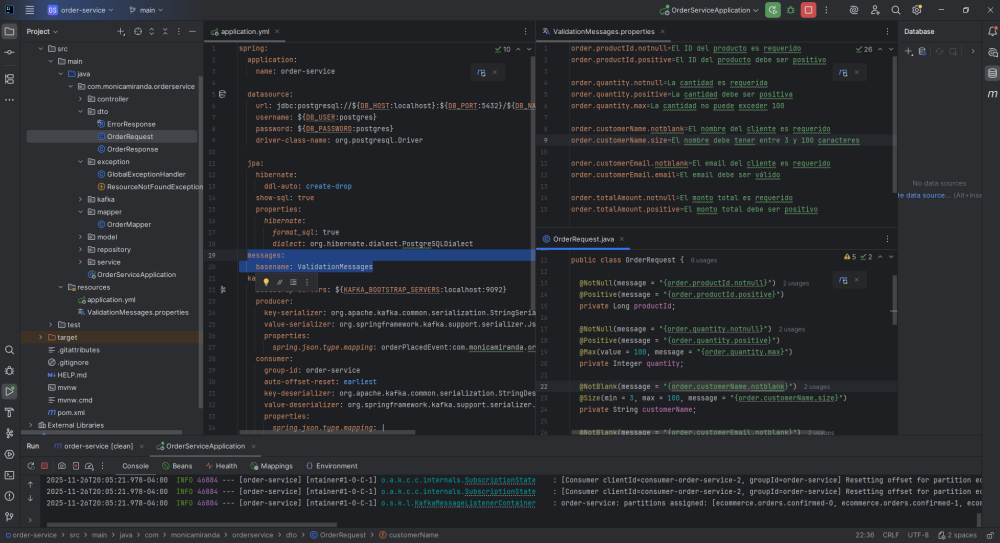


## 🧪 Funcionalidades REST  y Validaciones

- product-service: CRUD completo de productos + categoría, validaciones en DTOs, eventos ecommerce.products.created.
    - listar categorias
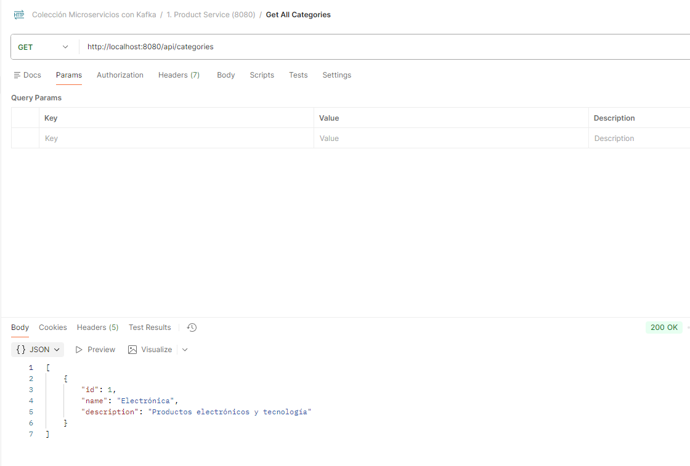
    - listar productos
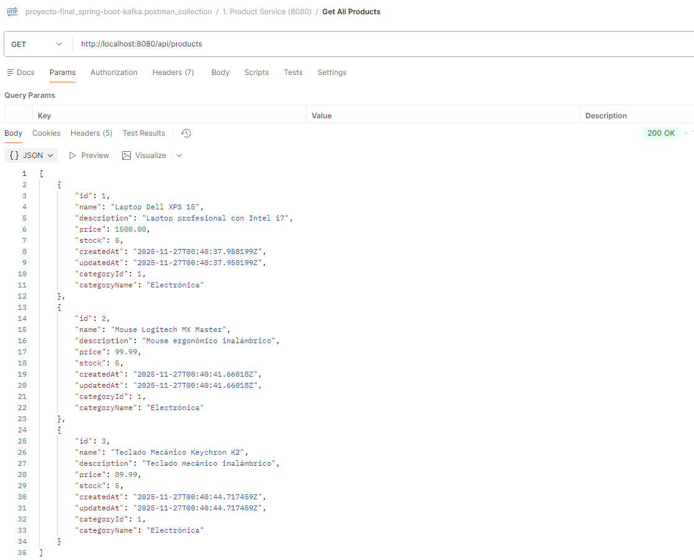
    - Mensaje creado en el topic ecommerce.products.created
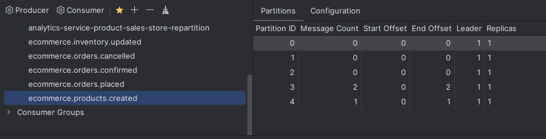  
- order-service: creación/listado/búsqueda de órdenes con estados PENDING/CONFIRMED/CANCELLED, producción de ecommerce.orders.placed, consumo de confirmaciones/cancelaciones.
    - Creación de ordenes
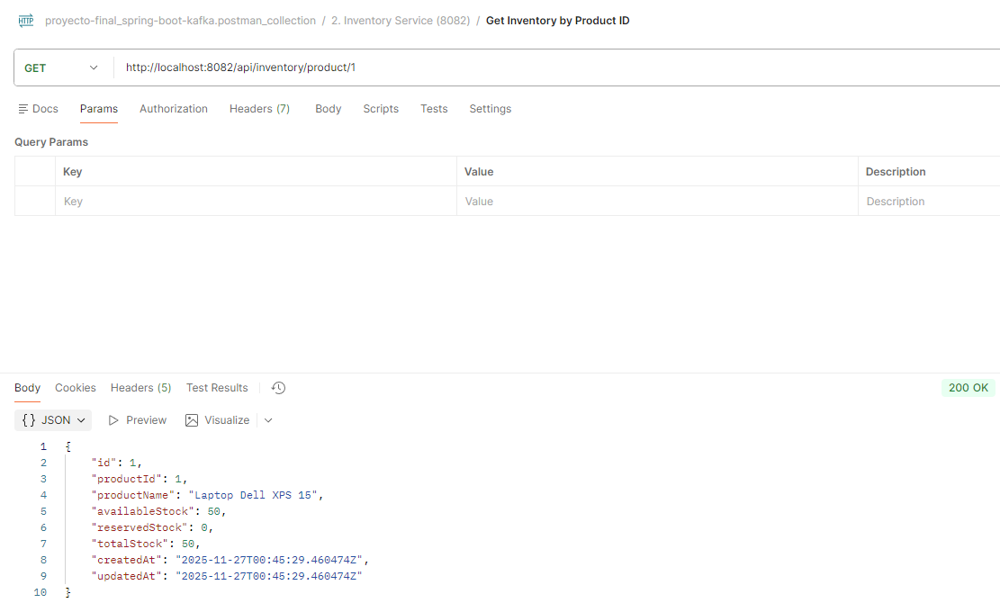
    - Ordenes en estado Pendiente, Confirmado y Cancelado por falta de stock
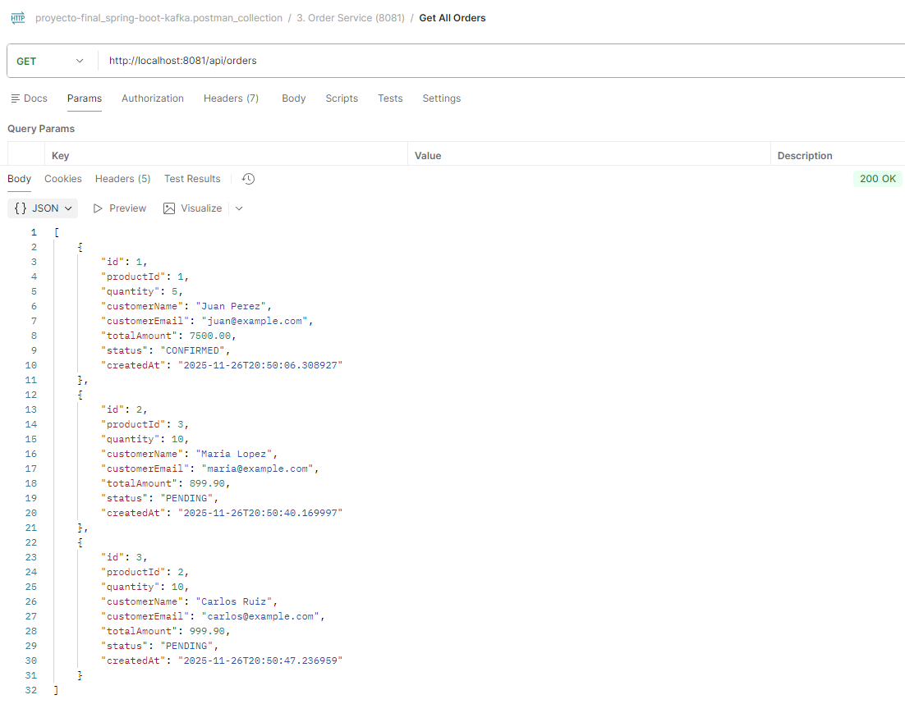
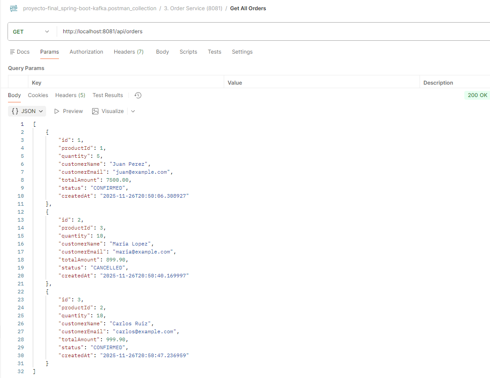
    - Mensaje creado en el topic ecommerce.orders.placed
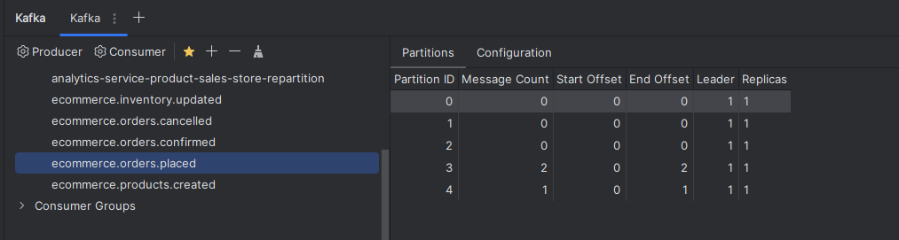
    - Mensaje creado en el topic ecommerce.orders.confirmed
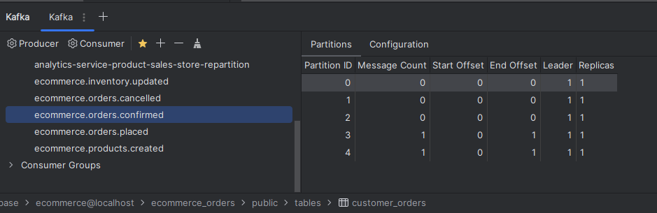
    - Mensaje creado en el topic ecommerce.orders.cancelled
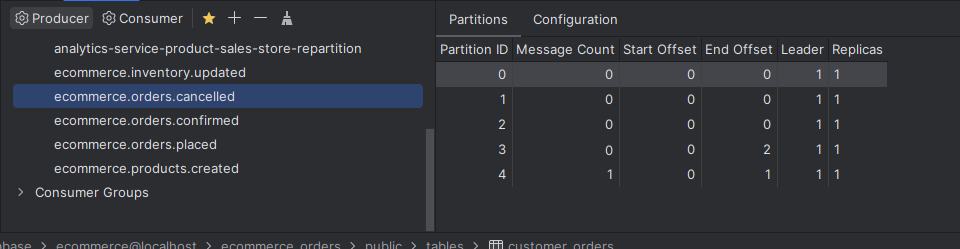
- inventory-service: administración de stock (crear, listar, consultar por productId), consumo de órdenes y publicación de confirmaciones/cancelaciones.
    - listar inventario de los productos creados
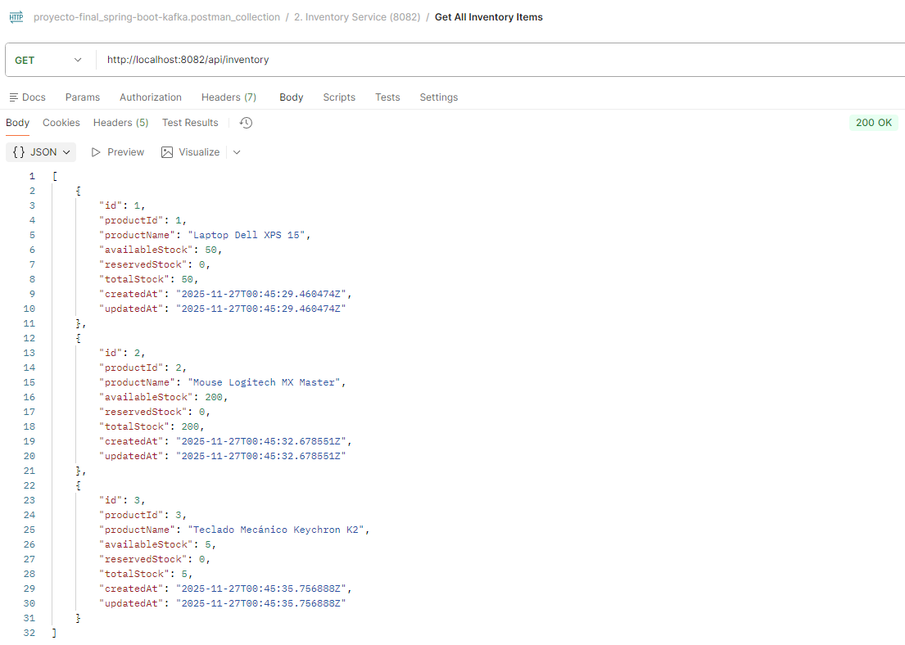
    - consulta por id del producto

- Bean Validation con mensajes en ValidationMessages.properties.
    - ValidationMessages.properties del servicio order-service

    - ValidationMessages.properties del servicio inventory-service

- GlobalExceptionHandler con respuestas claras para errores comunes.
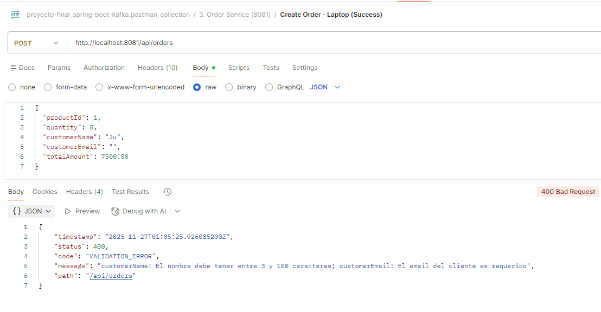
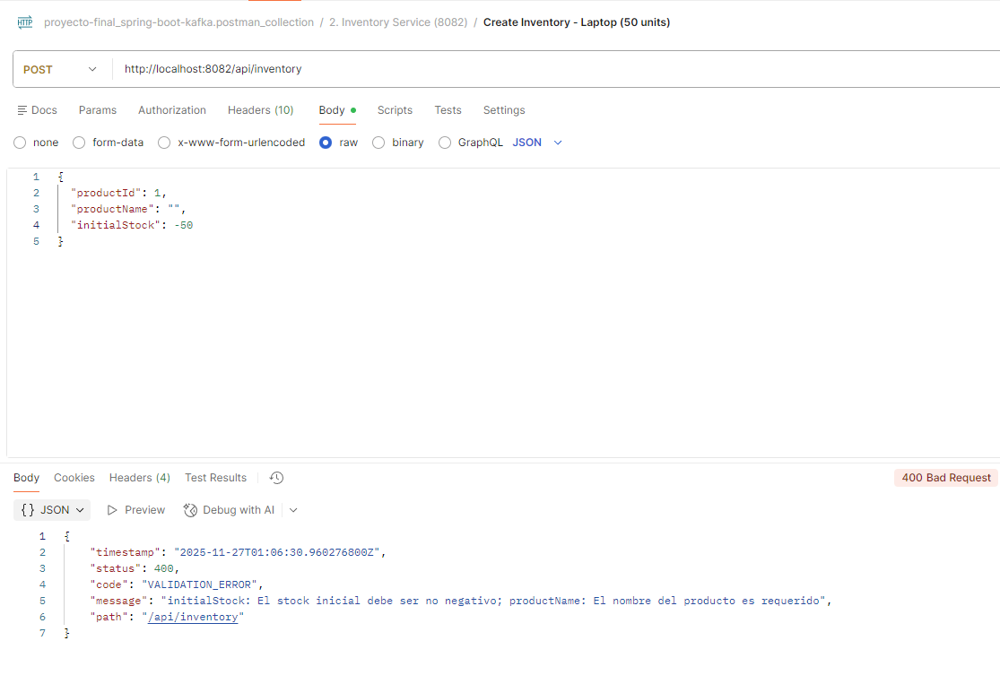
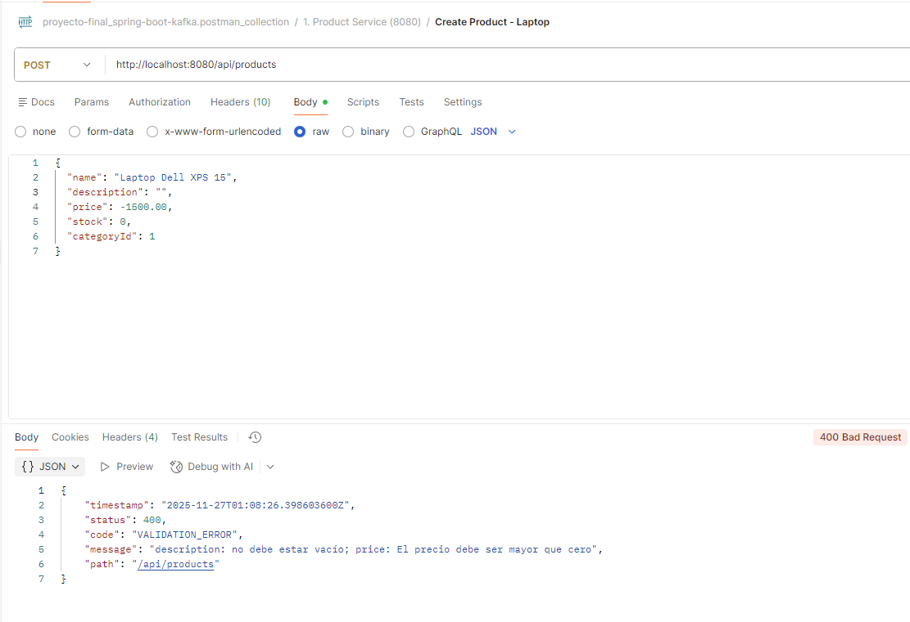

---
### 🗄 Tabla de Endpoints

- Product Service
```
| Método | Endpoint | Descripción |
|--------|----------|-------------|
| POST | /api/categories | Crear Categoria |
| GET | /api/categories | Listar Categoria |
| POST | /api/products | Crear Porducto |
| GET | /api/products | Listar Producto |
| GET | /api/products/{id} | Lista Producto por Id |
```

- Order Service
```
| Método | Endpoint | Descripción |
|--------|----------|-------------|
| POST | /api/orders | Crear orden |
| GET | /api/orders | Listar Orden |
| GET | /api/orders/{id} | Lista Orden por Id |
```
 - Inventory Service
```
| Método | Endpoint | Descripción |
|--------|----------|-------------|
| GET | /api/inventory| Lista stock del Producto|
| POST | /api/inventory | Crear stock de un Producto|
| GET | /api/inventory/{id} | Lista Inventario por Id |
| GET | /api/inventory/product/{id} | Lista Inventario por Id del Producto |
```
---
## 🧱 Cómo Probar Todo - Paso a paso 
👀 **Para el Proyecto se utilizó IntelliJ IDEA (Ultimate), por lo tanto los pasos descritos estan en base a este IDE**
###  1. Clonar los Microservicios del Repositorio GIT

| Servicio | Descripción | Repositorio                                                                         |
|---------|-------------|-------------------------------------------------------------------------------------|
| 🛒 **ecommerce-product-service** | Gestión de productos del ecommerce | [Ir al repositorio](https://github.com/monicamiranda160591-wq/ecommerce-product-service) |
| 📦 **ecommerce-inventory-service** | Control de inventario y stock | [Ir al repositorio](https://github.com/monicamiranda160591-wq/ecommerce-inventory-service) |
| 📑 **ecommerce-order-service** | Gestión de órdenes y flujo de compra | [Ir al repositorio](https://github.com/monicamiranda160591-wq/ecommerce-order-service) |

## 📂 Microservicio "ecommerce-product-service"
### 2. Abrir con el IDE el Microservicio "ecommerce-product-service"

- Ir al icono de Maven
    - Lifecycle
        - "clean"
        - "compile"
- Abrir "docker-compose.yml"
    - Ejecutar o correr Docker compose -up, en resumen lo mediante Docker:
  ```
    ✔ Levanta un contenedor PostgreSQL 15 (versión ligera Alpine).
    ✔ Crea una base de datos llamada ecommerce.
    ✔ Crea un usuario y contraseña:
        Usuario: ecommerce_user
        Contraseña: ecommerce_password
    ✔ Exponer el puerto 5432 a tu máquina (para conectarte desde IntelliJ, DBeaver, etc.).
    ✔ Guarda los datos en un volumen postgres-data para que no se borren al reiniciar el contenedor.
    ```
### 3. Conectarse a la Base de Datos
- Adicionar un DataSource PostgreSQL con los siguientes datos:
```
DB_HOST=localhost
DB_PORT=5432
DB_USER=ecommerce_user
DB_PASSWORD=ecommerce_password
```
### 4. Crear las variables de entorno minimas en el servicio "ecommerce-product-service" para que funcione

- DB_PASSWORD=ecommerce_password;DB_USER=ecommerce_user

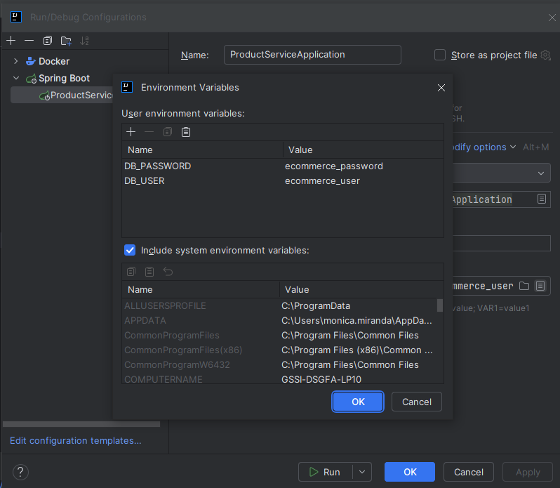

### 5. Ejecutar el Servicio "ecommerce-product-service"

- RUN o DEBUG a ProductServiceApplication desde IntelliJ IDEA
- El Servicio debe correr sin errores
- Esto debio crear las tablas categories y products

### 6. Crear Topics Requeridos

```bash
docker exec -it kafka kafka-topics --create --topic ecommerce.products.created --bootstrap-server localhost:9092 --partitions 5 --replication-factor 1

docker exec -it kafka kafka-topics --create --topic ecommerce.orders.placed --bootstrap-server localhost:9092 --partitions 5 --replication-factor 1

docker exec -it kafka kafka-topics --create --topic ecommerce.orders.confirmed --bootstrap-server localhost:9092 --partitions 5 --replication-factor 1

docker exec -it kafka kafka-topics --create --topic ecommerce.orders.cancelled --bootstrap-server localhost:9092 --partitions 5 --replication-factor 1
```
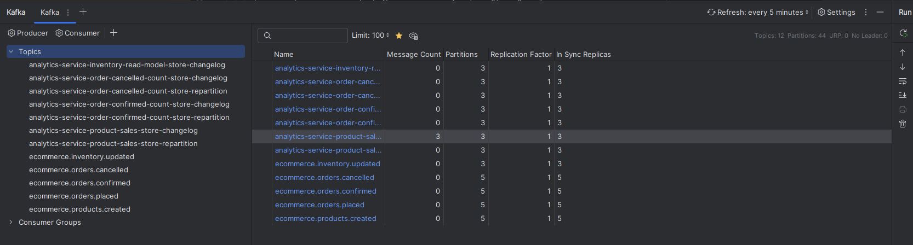

## 📂 Microservicio "ecommerce-order-service" y "ecommerce-inventory-service"
### 7. Abrir con el IDE cada uno en una nueva ventana los Microservicios "ecommerce-order-service" y "ecommerce-inventory-service"

- Ir al icono de Maven en ambos servicios y limpiar y compilar
    - Lifecycle
        - "clean"
        - "compile"

### 8. Crear las otras 2 Bases de Datos para cada Microservicio desde SQL

```sql
CREATE DATABASE ecommerce_orders;
CREATE DATABASE ecommerce_inventory;
```

### 9. Ejecutar el Servicio "ecommerce-orders-service"

- RUN o DEBUG a OrderServiceApplication desde IntelliJ IDEA
- El Servicio debe correr sin errores
- Esto debio crear la tabla customer_orders en la bd ecommerce_orders

### 10. Ejecutar el Servicio "ecommerce-inventory-service"

- RUN o DEBUG a InventoryServiceApplication desde IntelliJ IDEA
- El Servicio debe correr sin errores
- Esto debio crear la tabla inventory_items en la bd ecommerce_inventory


## 11. Descargar e importar la Colección de Postman

Puedes encontrar la colección de Postman para probar los endpoints del sistema completo aquí:

👉 **[Descargar colección de Postman](./postman/proyecto-final_spring-boot-kafka.postman_collection.json)**

---


